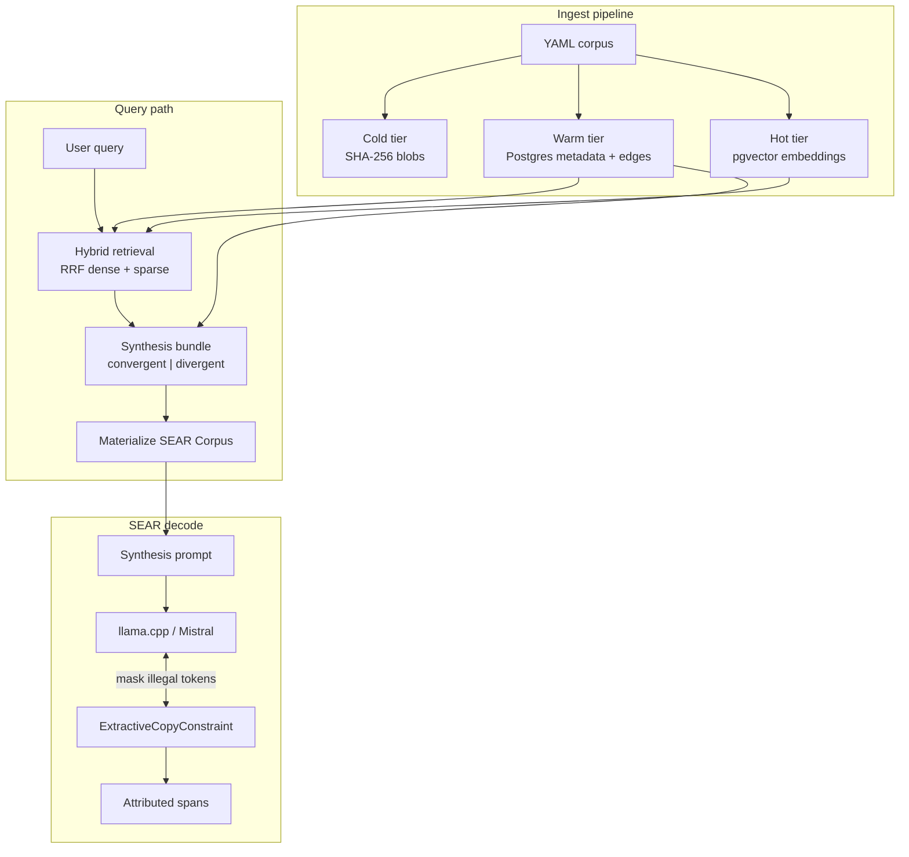
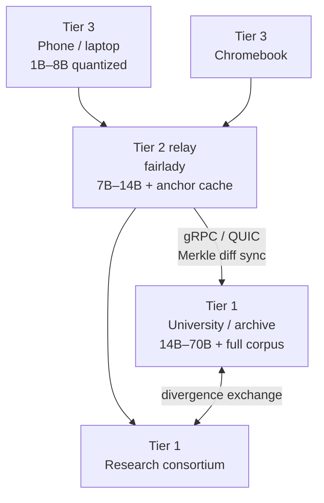

# GIN Architecture

Technical architecture for the Grounded Information Network — what is implemented in this repository, how the pieces connect, and where the design is headed.

For node-tier deployment specs and federation protocol detail, see [docs/GIN_Node_Architecture_v1.md](docs/GIN_Node_Architecture_v1.md).

---

## Design principles

These constraints govern every component decision:

1. **Complexity earns its place** — no layer exists for organizational convenience alone.
2. **Plurality is the mechanism** — independent nodes produce genuinely different grounded outputs; avoid covert homogenization.
3. **Honest by architecture** — SEAR constraints make hallucination structurally difficult; failures stay visible.
4. **Minimalism as discipline** — prove the core before building governance UI or federation polish.
5. **Provenance is first-class** — every claim traces to a content-addressed anchor.

---

## System overview

GIN separates **what can be said** (corpus + graph), **what is admitted** (Bookkeeper), and **how answers are produced** (SEAR reasoning). This repository implements the corpus tier, the SEAR reasoning layer, an automated Cartographer relation detector, and the Bookkeeper admission gate; federation is designed but not yet built.



---

## Three-layer epistemic model

The full GIN design assigns distinct responsibilities so no single component can inflate its own grounding record.

| Layer | Responsibility | Writes canonical graph? | In this repo |
|-------|----------------|-------------------------|--------------|
| **Cartographer** | Proposes typed edges (`cites`, `contradicts`, `supersedes`, `translated_from`) | No | `gin/cartographer/` — relatedness gate + combined register-robust relation detector (recall 1.0 / precision 0.875 on a 13-pair labeled set); measured on its own edge precision/recall axis |
| **Bookkeeper** | Verifies anchors, enforces DAG invariants, stamps provenance | Yes (sole writer) | `gin/bookkeeper/` — uniform admission gate (confidence, endpoint/anchor integrity, dedup, DAG acyclicity), provenance stamp; sole writer of `GraphState` |
| **Reasoning (SEAR)** | Read-only synthesis with exact span attribution | No | `sear/processor.py`, `scripts/corpus_generate.py` |

The Reasoning layer may feed **proposals** back to discovery, but never writes canonical edges directly. The three layers are independently falsifiable — Cartographer on edge precision/recall (`gin/cartographer/evaluation.py`), Bookkeeper on invariant maintenance (`tests/test_bookkeeper.py`), Reasoning on SEAR grounding rate — so no layer can inflate its own record. See **[docs/nc_cartographer_design.plan.md](docs/nc_cartographer_design.plan.md)** and **[docs/nc_reasoning_robustness_noisy_edges.plan.md](docs/nc_reasoning_robustness_noisy_edges.plan.md)**.

---

## Corpus tier

Each GIN node holds a **four-tier corpus stack**. This repo implements three tiers locally; the graph layer is represented as relational edge rows pending Bookkeeper admission.

### Cold tier — immutable archive

**Module:** `gin/corpus/cold.py`  
**Storage:** `data/cold/{hash[0:2]}/{hash}` (content-addressed, append-only)

- Documents and chunks are stored as SHA-256-addressed blobs.
- `content_hash` on warm-tier records points back to cold storage.
- Enables tamper-evident provenance and Merkle manifest sync in the federation design.

### Warm tier — structured records + full-text

**Module:** `gin/corpus/warm.py`  
**Storage:** Postgres tables `documents`, `chunks`, `edges`, `ingest_runs`

- Document metadata: outlet, title, source URI, ingest timestamp.
- Chunk records: text, `head_sentence`, `eval_layer`, `eval_tag`, `content_hash`.
- Epistemic edges between chunks with typed relationships.
- Generated `tsvector` column on `chunks.text` for BM25-style sparse retrieval.

### Hot tier — dense embeddings

**Module:** `gin/corpus/hot.py`  
**Storage:** `chunks.embedding vector(384)` with HNSW index

- Model: `sentence-transformers/all-MiniLM-L6-v2`
- Embeddings computed at ingest time; query embedding at retrieval time.
- Cosine distance search via pgvector.

### Graph layer (planned)

Target: Neo4j or Oxigraph for cross-corpus divergence queries. Currently, `edges` in Postgres serves the PoC; Bookkeeper admission will gate promotion to canonical graph state.

---

## Retrieval and synthesis

**Module:** `gin/corpus/retrieve.py`

### Hybrid retrieval

Two parallel searches merge via **Reciprocal Rank Fusion** (k=60):

1. **Dense** — pgvector cosine distance on chunk embeddings.
2. **Sparse** — `plainto_tsquery` + `ts_rank` on generated `tsvector`.

Optional filters (e.g. `eval_layer: realism`) apply to both legs.

### Synthesis bundling

`retrieve_for_synthesis()` expands seed hits into a `SynthesisBundle`:

1. Retrieve top-`k_seed` chunks (hybrid RRF).
2. **Re-rank seeds** by max per-sentence query keyword score; drop zero-relevance noise.
3. Fetch `contradicts` and `cites` edges among seeds.
4. Pull neighbor chunks linked by those edges.
5. Classify mode:
   - **divergent** — when a `contradicts` pair is **query-relevant on both sides**. The production gate is **IDF-weighted** (`idf_weighted_relevance` ≥ `DIVERGENCE_IDF_FLOOR` = 0.13): one *distinctive* shared word (e.g. `wildfire`) suffices, a generic one (e.g. `district`) does not — this is what lets real reframing pairs that share almost no vocabulary still reach divergent mode. Without corpus IDF (unit tests) it falls back to the lexical gate (`DIVERGENCE_RELEVANCE_FLOOR` + `matched_keyword_count` ≥ 2 for queries with ≥3 keywords). Close RRF competitors without a contradicts edge are corroboration, not divergence.
   - **convergent** — otherwise (including bureau + independent survey agreeing on the same statistic).
6. Build pairs (query-irrelevant contradicts pairs excluded); boost RRF scores for paired chunks; cap at `k_max`.

Legacy path: when `query` is empty, any contradicts edge or close multi-outlet competitors still force divergent mode.

**Module:** `gin/corpus/materialize.py` orders pair-adjacent hits, builds a SEAR `Corpus`, and computes `required_doc_groups` — frozensets of doc indices that must both be quoted when a `contradicts` edge links them.

**Module:** `gin/corpus/generate.py` — convergent decode steers to top query-relevant doc; `competing_same_tag` path emits one AMBIGUOUS corroboration span across bureau + survey outlets. See [ENG 02](docs/GIN_ENG_02_Eval_Baseline_v1.md) and `docs/nc_phase3_divergence_correctness.plan.md`.

**Module:** `gin/corpus/prompts.py` assembles a metadata-only source manifest (chunk bodies live in the SEAR corpus, not the prompt) plus mode-specific task instructions.

---

## SEAR constrained decoding

**Modules:** `sear/corpus.py`, `sear/processor.py`, `sear/connectives.py`

### Corpus as grammar

`Corpus` indexes each document as a token-id sequence and builds `start_index: token_id → [(doc_id, position), ...]`. The logits processor consults this index at every decode step; spans copy token-by-token from real corpus positions, sidestepping cross-document BPE boundary issues for the baseline.

### Cursor finite-state machine

`ExtractiveCopyConstraint` tracks three modes:

| Mode | Behavior |
|------|----------|
| `BOUNDARY` | May start a new extractive span, emit EOS, or (after first closed span) emit connectives / cite markers |
| `IN_SPAN` | Advance cursors; legal tokens = union of `continuation(doc, pos)` across live cursors |
| `IN_CONNECTIVE` | Walk multi-token connective phrases (`but`, `whereas`, `on the other hand`, …) |

On each step, all non-allowed vocabulary positions are masked to `-1e30`.

### Span lifecycle

1. **Start** — token must appear in `start_index` at an unused position.
2. **Continue** — cursors fan out across documents sharing the prefix; prune when tokens diverge.
3. **Close** — at `min_span_len`, allow `|` delimiter or EOS; record `Segment` with `(doc_id, start, end)` sources.
4. **Divergence auto-close** — when `close_on_doc_divergence=True`, close when cursors narrow **at the current token** (not "ever since span start") and only if `_span_close_permitted()` (min length + sentence-end when configured).

### Connectives and citations

- **Connectives** — tokenizer-aligned phrase inventory stratified into contrastive, additive, and concessive categories; gated by edge type at materialisation time; only available after at least one closed extractive span.
- **Cite markers** — `[1]`, `[2]`, … mapped to doc indices; emitted after spans to attribute bracket-style references.
- **Used positions** — `(doc_id, position)` tuples are consumed after span close to prevent verbatim reuse of the same source span.

### Attribution render

`constraint.render(detok)` produces human-readable output:

```
"Emergency services confirmed 142 people received treatment"[1]  <- EXACT: CentralWire[12:24] [steered]
  |  however
"Emergency services confirmed 98 people received treatment"[2]  <- EXACT: MetroDaily[12:24] [steered]
```

`AMBIGUOUS` tags spans whose cursors survived from multiple documents at close time. `[steered]` / `[divergence-steered]` tags indicate the span start was guided by a retrieval heuristic rather than freely chosen by the model; no tag means free selection.

---

## Layered provenance record

The "honest by architecture" property of SEAR applies precisely to the generation layer: given the retrieved corpus, output is verbatim extraction with exact span attribution. Three additional layers influence the output and each now contributes to a structured provenance record emitted alongside the attribution.

### Retrieval manifest

**Module:** `gin/corpus/retrieval_manifest.py`
**Storage:** `data/retrieval_manifests/{hash[0:2]}/{hash}.json` (content-addressed)

At synthesis time, `build_retrieval_manifest(query, bundle)` serialises the query string, its SHA-256 hash, synthesis mode, edge types present, and per-chunk retrieval ranks and RRF scores into a `RetrievalManifest`. The manifest is content-hashed — identical retrieval events produce the same hash and are stored once. `materialize_from_synthesis()` returns the manifest as a fourth value and stores `manifest_hash` on `SynthesisContext`.

A **retrieval confidence floor** (`RETRIEVAL_CONFIDENCE_FLOOR = 0.010`) causes `retrieve_for_synthesis()` to raise `RetrievalConfidenceError` when the top RRF score falls below the absolute threshold, analogous to the zero-cursor grounding failure signal in SEAR. This prevents low-confidence retrieval from silently producing attributed-but-misleading output.

### Edge-type-gated connectives

**Module:** `sear/connectives.py`

The connective inventory is stratified into `CONTRASTIVE_PHRASES`, `ADDITIVE_PHRASES`, and `CONCESSIVE_PHRASES`. `phrases_for_edge_types(edge_type_set)` selects the appropriate subset based on the epistemic relationships present in `bundle.edges`: a `contradicts` edge restricts the model to contrastive connectives; a `cites` edge admits additive and concessive phrases. The selected phrase set is built into the connective inventory at materialisation time and stored on `SynthesisContext` alongside `active_edge_types`. Connective framing is now constrained by the typed graph rather than free model choice.

### Steering guidance tags

**Module:** `sear/processor.py`

`Segment` carries a `guidance` field (`""` free, `"steered"`, `"divergence-steered"`). In `_begin_span`, the opening cursor position is checked against `preferred_starts` and `divergence_starts`; the guidance string is recorded and attached to the closed segment. `render()` appends `[steered]` or `[divergence-steered]` to the attribution line, making the distinction between a model-chosen span and a heuristic-steered span visible in the output.

### Synthesis manifest

**Module:** `gin/corpus/synthesis_manifest.py`

`render_synthesis_manifest(query, ctx, segments, render_output, retrieval_manifest=...)` assembles a single structured text record covering all four layers:

```
=== Synthesis Manifest ===

--- Retrieval ---   manifest hash, mode, per-chunk ranks, confidence floor verdict
--- Graph ---       active edges, required doc groups, groups-satisfied check
--- Steering ---    connective mode (with edge-type derivation), preferred/forbidden starts
--- Generation ---  span count, free vs steered vs divergence-steered breakdown
--- Attribution --- verbatim render() output with [steered] tags
```

`scripts/corpus_generate.py` prints this record after every generation run.

---

## End-to-end data flow

```
YAML / ingest
    → cold.store(bytes)           # content hash
    → warm.upsert_document/chunk  # metadata + tsv
    → hot.embed_and_store         # vector(384)

Query
    → retrieve_for_synthesis
    → materialize_from_synthesis  # Corpus + SynthesisContext
    → build_synthesis_prompt      # manifest + task
    → ExtractiveCopyConstraint    # LogitsProcessor on llama.cpp
    → finalize() + render()       # attribution record
```

**Entry point:** `scripts/corpus_generate.py`

---

## Database schema

Defined in `docker/init-db.sql`:

```
documents
  doc_id UUID PK
  content_hash TEXT UNIQUE
  outlet, title, source_uri, source_type, ingested_at

chunks
  chunk_id TEXT PK
  doc_id → documents
  text, head_sentence, eval_layer, eval_tag, content_hash
  embedding vector(384)
  tsv tsvector GENERATED

edges
  src_chunk_id, dst_chunk_id → chunks
  edge_type, note
  UNIQUE (src, dst, type)

ingest_runs
  run_id, status, stats_json, timestamps
```

Indexes: GIN on `tsv`, HNSW on `embedding`, B-tree on `eval_layer` and `doc_id`.

---

## Module map

```
GIN/
├── gin/
│   └── corpus/
│       ├── cold.py                # SHA-256 blob store
│       ├── warm.py                # Postgres CRUD, edges, ingest runs
│       ├── hot.py                 # SentenceTransformer embeddings
│       ├── db.py                  # Connection helpers, env config
│       ├── models.py              # ChunkHit, SynthesisBundle, SynthesisContext, …
│       ├── ingest.py              # YAML → tiered ingest pipeline
│       ├── corpus_manager.py      # Local JSONL/txt ingest + immutable store
│       ├── manifest.py            # Versioned snapshot manifests
│       ├── retrieve.py            # Hybrid search + synthesis bundling + RetrievalConfidenceError
│       ├── materialize.py         # ChunkHit[] → sear.Corpus + SynthesisContext
│       ├── divergence.py          # Divergence zone + forbidden-start computation; IDF-anchored fallback zone for structurally-dissimilar pairs
│       ├── relevance.py           # Query-sentence + IDF-weighted match scoring (divergence gate, span steering)
│       ├── prompts.py             # Synthesis prompt templates
│       ├── retrieval_manifest.py  # Content-addressed retrieval event record
│       └── synthesis_manifest.py  # Human-readable layered provenance render
├── sear/
│   ├── corpus.py            # Token-indexed document store
│   ├── processor.py         # ExtractiveCopyConstraint FSM + Segment.guidance
│   ├── connectives.py       # Stratified connective inventory (contrastive/additive/concessive)
│   └── bias.py              # BiasedGINLogitsProcessor (logit nudge layer)
├── scripts/                 # CLI entry points
├── tests/                   # pytest suite
├── data/
│   ├── synthetic/           # YAML eval corpus
│   ├── cold/                # Content-addressed blobs (gitignored content)
│   └── retrieval_manifests/ # Content-addressed retrieval event records
└── docker/
    ├── docker-compose.yml   # pgvector Postgres
    └── init-db.sql          # Schema bootstrap
```

---

## Node topology (target deployment)



| Tier | Corpus | Inference | Federation role |
|------|--------|-----------|-----------------|
| **1** | Full hot/warm/cold/graph | Large local model + SEAR adapter | Anchor custodian; publishes diffs |
| **2** | Partial cache | Medium model on always-on relay | Cache-first routing; upstream delegation |
| **3** | Personal cache + annotations | Small quantized model | Offline-first client; queues on disconnect |

Federation syncs **anchor metadata** (topic fingerprints, cursor density, staleness) via Merkle-tree diffing — not full corpus transfer. Each node retains sovereignty over its own cold archive.

---

## Build phases

### Phase 1 — Dense baseline (current)

Prove SEAR behavior on stock Mistral with grammar-constrained extractive synthesis:

- ✅ `ExtractiveCopyConstraint` with cursor fan-out, pruning, connectives, cites
- ✅ Corpus tier PoC (Postgres + pgvector + cold store)
- ✅ Hybrid retrieval and query-aware divergent/convergent synthesis modes
- ✅ Live generation via `llama-cpp-python`
- ✅ Layered provenance record (retrieval manifest, guidance tags, synthesis manifest)
- ✅ Edge-type-gated connective vocabulary
- ✅ Retrieval confidence floor (`RetrievalConfidenceError`)
- ✅ SEAR vs RAG eval harness (`scripts/eval_run.py`, `gin/eval/`)
- ✅ Preliminary eval baseline (structural prevention + NC epistemic targets) — see [docs/GIN_ENG_02_Eval_Baseline_v1.md](docs/GIN_ENG_02_Eval_Baseline_v1.md)

**Validation:** `pytest`, `python scripts/sear_phase1.py --selftest`

### Phase 2 — Bookkeeper separation

- Canonical graph admission gate
- Cartographer proposals vs verified edges
- Reasoning layer strictly read-only on graph state

### Phase 3 — Federation

- ✅ Two-node divergence demo (inter-corpus, same machinery) — measured on **real fetched text** (`20260705T043114Z`, `divergence_fidelity` 1.0), generalized across three framing registers and confirmed model-independent on Qwen2.5-7B. See [docs/nc_real_text_divergence_generalization.plan.md](docs/nc_real_text_divergence_generalization.plan.md). This is the divergence *signal* across two corpora; the transport below is still unbuilt.
- ✅ Sovereign delegation loop (zero-cursor routing v1) — two node processes,
  HTTP+JSON schema-first transport behind the `PeerClient` seam
  (`gin/federation/`); pre-commitment grounding failures delegate to the
  configured peer; B's answer relays with attribution intact and explicitly
  marked as B's. Measured: `data/eval_runs/20260714T175645Z/federation_metrics.json`.
  Spec: docs/superpowers/specs/2026-07-13-federation-v1-sovereign-delegation-design.md
- ✅ Merkle diff sync of anchor metadata (spec #2) — 16-bucket Merkle tree
  over (chunk_id, content_hash, outlet, title); background asyncio loop per
  node pulls its peer's root, drills into mismatched buckets only. Measured:
  `data/eval_runs/20260715T073932Z/anchor_sync_metrics.json` (0 diff vs. peer ground
  truth; no-op cycle O(1) bytes; single-chunk-change cycle « full corpus).
  Not load-bearing at N=2 (built as the primitive for N>2 peer selection).
  Spec: docs/superpowers/specs/2026-07-14-merkle-anchor-sync-design.md
- ✅ Peer selection at N>2 (spec #3) — third node added (monetary-policy
  corpus); a node that can't ground locally ranks its peers by dense+sparse
  RRF fusion (reusing the retrieval stack's `RRF_K`) over routing summaries
  synced alongside anchors — one background sync loop per peer, each refetching
  a peer's summary until it is cached — and delegates to the best-matching peer
  first, falling back through the ranked list (every hop still `hop_count=1`).
  Measured on three real Mistral-7B nodes (one CPU-only):
  `data/eval_runs/20260715T192750Z/peer_selection_metrics.json` — selection
  precision@1 1.0, avg peers tried 1.0, routing FP 0, fabrication 0.0,
  attribution 1.0, honest refusal 1.0.
  Spec: docs/superpowers/specs/2026-07-15-peer-selection-n3-design.md
- 🔲 gRPC/QUIC wire (swap inside `PeerClient`; institutional target)
- 🔲 Trust weights (per-domain asymmetric), PKI/mTLS

### Phase 4 — SEAR training loop (Tier 1)

Four-stage training per [docs/GIN_Node_Architecture_v1.md](docs/GIN_Node_Architecture_v1.md):

1. Anchor extraction with retrieval traces
2. Grammar-constrained SFT (`citation-before-claim`)
3. Contrastive divergence pairs
4. RLHF/DPO reward pass penalizing false synthesis of conflict

---

## Extension points

| Hook | Location | Purpose |
|------|----------|---------|
| Embedding model | `gin/corpus/hot.py` `EMBEDDING_MODEL` | Swap retriever for domain-specific encoders |
| Connective phrases | `sear/connectives.py` `CONTRASTIVE_PHRASES` / `ADDITIVE_PHRASES` / `CONCESSIVE_PHRASES` | Extend per-category connective vocabulary |
| Connective gating | `sear/connectives.py` `phrases_for_edge_types()` | Map new edge types to connective categories |
| Ambiguity threshold | `gin/corpus/retrieve.py` `AMBIGUITY_SCORE_DELTA` | Tune divergent mode sensitivity (legacy no-query path) |
| Divergence IDF floor | `gin/corpus/retrieve.py` `DIVERGENCE_IDF_FLOOR` | Min IDF-weighted query relevance for a contradicts side to count as divergence |
| Retrieval confidence floor | `gin/corpus/retrieve.py` `RETRIEVAL_CONFIDENCE_FLOOR` | Minimum absolute RRF score before synthesis is declined |
| `min_span_len` | `ExtractiveCopyConstraint` constructor | Minimum tokens before span close |
| Eval layers | `gin/corpus/models.py` `EvalLayer` | Filter retrieval / ingest by corpus slice |
| Zero-cursor fallback | `sear/processor.py` | Federation routing (planned) |
| Retrieval manifest storage | `gin/corpus/retrieval_manifest.py` `retrieval_manifests_dir()` | Override manifest storage root |

---

## Related documents

| Document | Focus |
|----------|-------|
| [docs/GIN_Node_Architecture_v1.md](docs/GIN_Node_Architecture_v1.md) | Tier 1/2/3 specs, SEAR training loop, federation protocol |
| [docs/GIN_ENG_01_SEAR_PoC_Spec.md](docs/GIN_ENG_01_SEAR_PoC_Spec.md) | SEAR proof-of-concept engineering spec |
| [docs/GIN_The_Whole_Frame.md](docs/GIN_The_Whole_Frame.md) | Program-level synthesis and roadmap honesty |
| [docs/GIN_02_Productive_Divergence.md](docs/GIN_02_Productive_Divergence.md) | Divergence-as-feature thesis |
